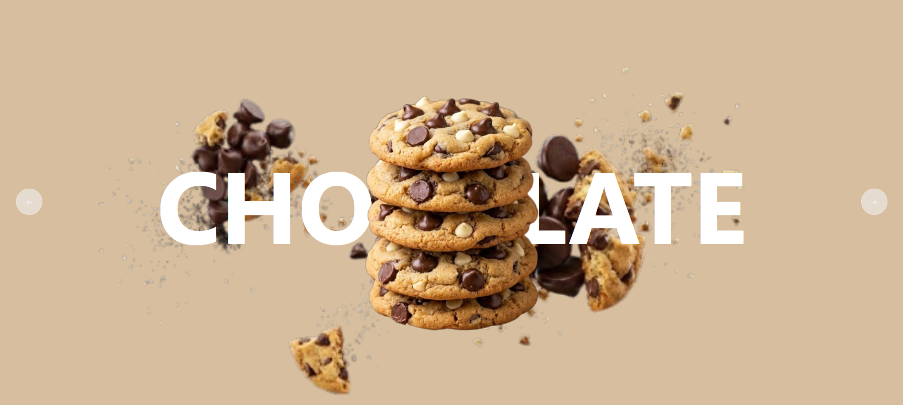
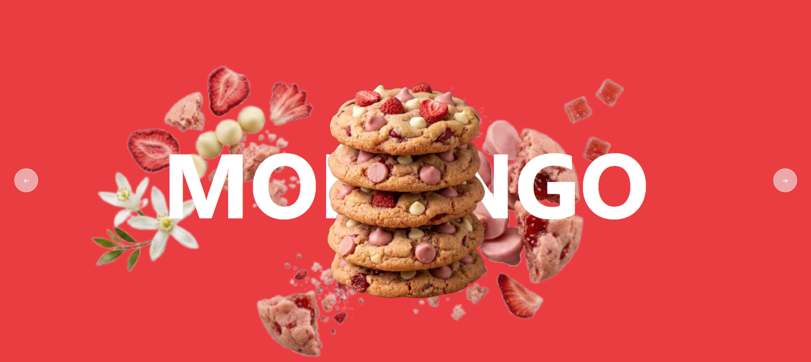
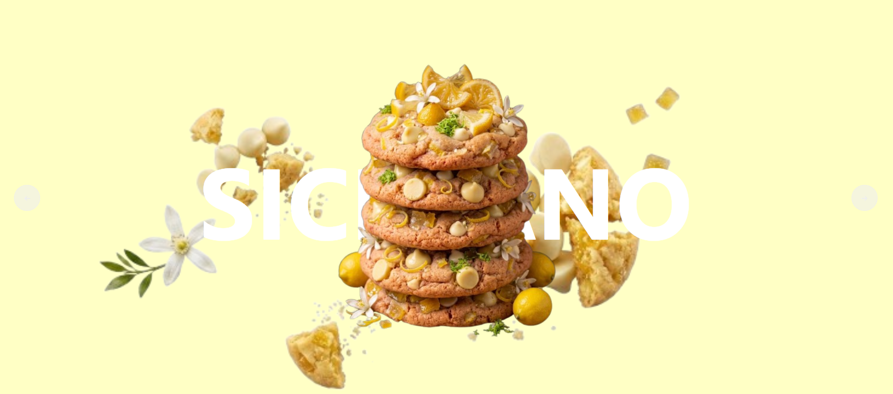

# 🍪 Cookie Slider Interativo

Um carrossel de exibição de produtos moderno e dinâmico, desenvolvido com **HTML5, CSS3 e JavaScript puro**. O projeto simula a apresentação de sabores de cookies com transições de cores de fundo e animações de elementos.

---

## 💻 Tecnologias Utilizadas

* **HTML5:** Estrutura semântica dos elementos e suporte a variáveis CSS inline.
* **CSS3:** Animações (`@keyframes`), posicionamento absoluto, variáveis CSS (`var(--background)`), e estilização responsiva.
* **JavaScript (ES6):** Manipulação de classes do DOM, controle de índice ativo e navegação entre slides.

---

## ⚙️ Funcionalidades

* 🎨 **Cores de Fundo Dinâmicas:** Cada produto define sua própria cor temática via CSS Variables.
* 🔄 **Carrossel Infinito:** Navegação contínua nos botões de avançar (`→`) e voltar (`←`).
* ✨ **Animações de Entrada:** Efeitos visuais suaves na transição dos elementos ao trocar de slide.
